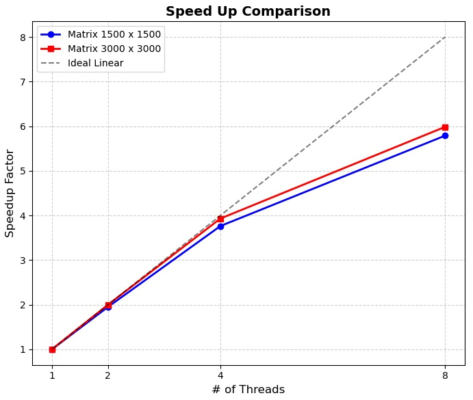
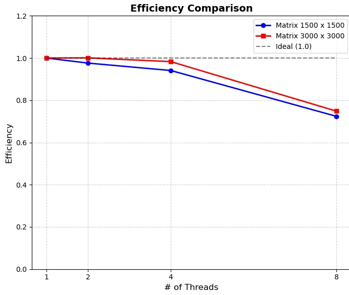

# Parallel Matrix Operations using OpenMP

## Overview

This project demonstrates parallel programming in C++ using OpenMP by implementing and optimizing several matrix operations. The project compares sequential and parallel execution while evaluating the impact of multi-threading and memory optimizations on computational performance.

The implemented operations include:

- Matrix initialization
- Matrix summation
- Maximum element search
- Matrix multiplication
- Cache-optimized matrix multiplication using matrix transposition

The project benchmarks performance using different matrix sizes and thread counts to analyze scalability on multi-core processors.

---

## Features

- Parallel matrix initialization
- Parallel matrix summation
- Parallel maximum value search
- Parallel matrix multiplication
- Matrix transposition optimization for improved cache locality
- Performance benchmarking using multiple thread counts

---

## Technologies

- C++
- OpenMP
- GCC
- Shared-memory parallel programming

---

## Project Structure

```
.
├── Parallel with transpose.cpp
├── Parallel without transpose.cpp
├── SeqCode.cpp
└── README.md
```

---

## Matrix Operations

### Matrix Allocation

Matrices are dynamically allocated using a two-dimensional pointer structure.

```cpp
int** allocateMatrix(int n);
```

Each matrix is allocated row by row to support large matrix sizes efficiently. Memory is released after execution to prevent memory leaks.

---

### Matrix Initialization

The matrices are initialized in parallel using OpenMP.

```cpp
#pragma omp parallel for collapse(2) schedule(static)
```

The `collapse(2)` clause combines the nested loops into a single iteration space, allowing OpenMP to distribute work more evenly across threads.

Since each element requires the same amount of work, `schedule(static)` minimizes scheduling overhead.

---

### Matrix Summation

The sum of all matrix elements is computed in parallel using a reduction.

```cpp
#pragma omp parallel for collapse(2) reduction(+:total_sum)
```

Each thread maintains a private copy of the partial sum, and OpenMP combines all partial results after execution, preventing race conditions.

---

### Maximum Element Search

The maximum matrix value is found using OpenMP's maximum reduction.

```cpp
#pragma omp parallel for collapse(2) reduction(max:global_max)
```

Each thread searches independently within its assigned portion of the matrix before OpenMP determines the global maximum.

---

### Matrix Multiplication

Matrix multiplication is parallelized by assigning different output elements to different threads.

```cpp
#pragma omp parallel for collapse(2) schedule(static)
```

Each thread computes one portion of the resulting matrix independently.

---

## Matrix Transposition Optimization

To improve cache efficiency, the second matrix is transposed before multiplication.

Instead of accessing matrix **B** column-by-column:

```
B[k][j]
```

the algorithm accesses

```
B_T[j][k]
```

which allows both matrices to be read sequentially in memory.

Benefits include:

- Improved cache locality
- Reduced cache misses
- Faster memory access
- Better overall multiplication performance

This optimization significantly improves execution time for large matrices.

---

## Performance Evaluation

The application benchmarks the implemented algorithms using different matrix sizes:

- 1500 × 1500
- 3000 × 3000

Each test is executed using different OpenMP thread counts:

- 1 thread
- 2 threads
- 4 threads
- 8 threads

Execution time is measured using:

```cpp
omp_get_wtime()
```

allowing direct comparison between sequential and parallel implementations.

---

## Performance Results

### Speedup



### Parallel Efficiency



---

## OpenMP Directives Used

| Directive | Purpose |
|-----------|---------|
| `parallel for` | Executes loop iterations concurrently |
| `collapse(2)` | Flattens nested loops for improved load balancing |
| `schedule(static)` | Divides work evenly among threads |
| `reduction(+:)` | Safely combines partial sums |
| `reduction(max:)` | Safely computes the global maximum |

---

## Compilation

Compile with OpenMP support enabled.

```bash
g++ Sequential.cpp -O2 -o sequential

g++ Parallel.cpp -O2 -fopenmp -o parallel

g++ Parallel_Transpose.cpp -O2 -fopenmp -o parallel_transpose
```

---

## Running

```bash
./sequential

./parallel

./parallel_transpose
```

---

## Performance Highlights

The project demonstrates several important concepts in high-performance computing:

- Multi-threaded execution using OpenMP
- Shared-memory parallelism
- Thread synchronization using reductions
- Cache-aware optimization through matrix transposition
- Performance comparison across multiple thread counts
- Scalability analysis for large matrix computations

---

## Future Improvements

Possible extensions include:

- Block (tiled) matrix multiplication
- SIMD vectorization
- Dynamic scheduling experiments
- Performance profiling
- GPU implementation using CUDA or OpenCL

---

## License

This project is shared for educational and portfolio purposes.
